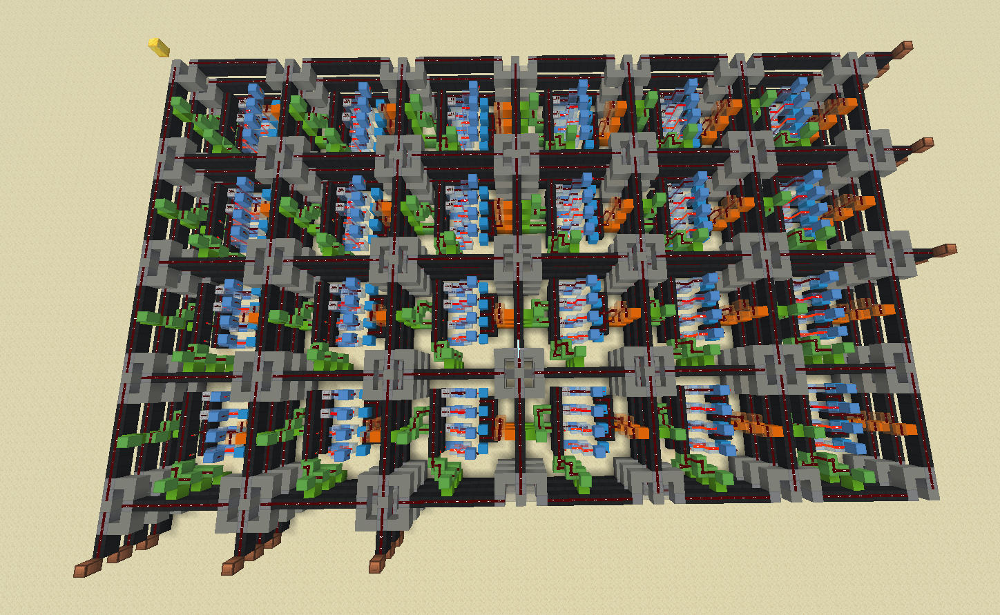

# Redstone HLS

Redstone High Level Synthesis (HLS) is a hardware synthesis project that programs an FPGA built in Minecraft. It includes a small Verilog-like hardware description language, netlist generation, placement and routing, and bitstream generation for configuring the FPGA.

### Board Representation

The FPGA is an n×m island-style architecture with configurable logic blocks (CLBs), programmable routing channels, switch boxes, connection blocks, and I/O blocks.


_Example 6×4 FPGA, ready to be programmed_

Each CLB can be configured to implement supported logic operations such as `AND`, `OR`, and `NOT`. The routing fabric connects CLBs to each other and to the FPGA's inputs and outputs through programmable switch and connection blocks.

The FPGA architecture is represented by a _FPGA Object Notation (FON)_, allowing the placement and routing algorithms to operate on an abstract representation of the hardware before generating its physical Minecraft implementation.

### Placement & Routing

The router maps a gate-level netlist onto the available CLBs and finds routes through the FPGA fabric using a cost function based on **propagation delay and wire length**. Routing decisions configure the appropriate switch boxes, connection blocks, and wires.

### Bitstream Generation

Once placement and routing are complete, the FPGA configuration is converted into a Minecraft `.mcfunction` file. When ran in game, the generated commands act as the bitstream of a real FPGA, programming the original circuit onto the board. An example of this bitsream may look like this:

```
/setblock ~28 ~-2 ~25 air
/setblock ~40 ~-2 ~-2 air
/setblock ~15 ~-2 ~12 redstone_wire
/setblock ~24 ~-2 ~22 redstone_wire
/setblock ~24 ~-2 ~23 repeater[facing=north]
/setblock ~38 ~-7 ~11 repeater[facing=west]
...
```

### Scope

FPGA placement and routing is a complex problem, so this project focuses on a manageable subset of the problem. The initial Minecraft FPGA only supports combinational logic, excluding sequential elements such as flip-flops and memory. This allows the project to focus on the core challenges of placement and routing in a simpler environment.

### Resources

- https://www.eecg.toronto.edu/~vaughn/challenge/fpga_arch.html
- https://cse.usf.edu/~haozheng/teach/cda4253/doc/fpga-arch-overview.pdf
- http://www.gstitt.ece.ufl.edu/courses/fall13/eel4720_5721/reading/Routing.pdf
- https://www.eng.uwo.ca/people/wwang/ece616a/616_extra/notes_web/5_dphysicaldesign.pdf
